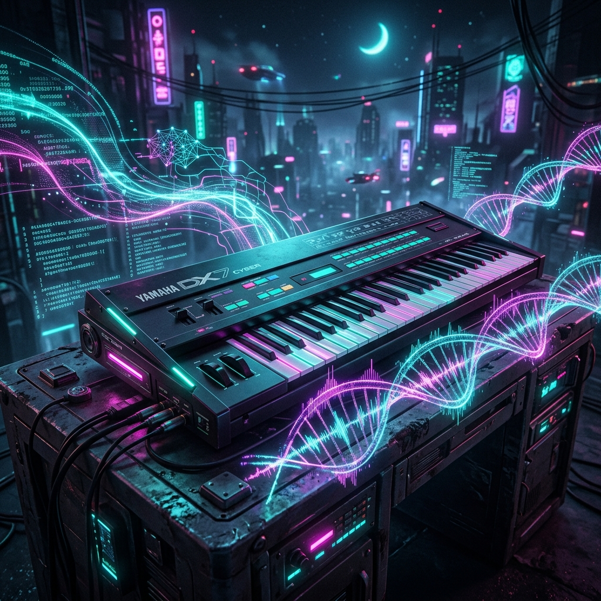

<p align="center">
  
</p>

# FM AI Engineer (V2.0 Multimodal Edition)

**FM AI Engineer** ist die ultimative, KI-gestützte Sounddesign-Workstation für die legendäre Yamaha DX7 Architektur. Durch die Integration von Google Gemini 1.5 Flash durchbricht dieses Tool die Grenzen klassischer Synthesizer-Programmierung: Verwandle Audio, Bilder und natürliche Text-Beschreibungen direkt in technisch präzise, spielbare FM-Synthese-Parameter!

Egal ob du einen Synth-Bass aus einem Skrillex-Track nachbauen willst (Audio-to-Patch), ein stimmungsvolles Wald-Bild vertonen möchtest (Image-to-Patch) oder einfach nur "ein warmes 80s E-Piano" eintippst – die KI übersetzt deine Intentionen direkt in einen hochkomplexen 6-Operator-Patch.

## 🚀 The V2.0 Multimodal Features

Mit dem V2.0 Update ist das Projekt von einem simplen Text-Generator zu einem vollwertigen, multimodalen KI-Labor herangewachsen:

- 🎵 **Audio-to-Patch (Reverse Engineering)**: Lade eine `.wav` oder `.mp3` Datei hoch. Die KI analysiert das Frequenzspektrum und die Hüllkurven und generiert einen DX7 Patch, der diesen Sound exakt nachahmt.
- 🖼️ **Image-to-Patch (Synästhesie)**: Lade Bilder (`.jpg`, `.png`) hoch. Die App übersetzt Stimmung, Farben und Textur in ein passendes klangliches Gegenstück.
- 👻 **Ghost in the Machine (Ambient Mode)**: Lass die KI für dich spielen! Dieser Modus feuert automatisch atmosphärische, arpeggierte Noten ab und mutiert den Synthesizer algorithmisch im Hintergrund weiter. Ein sich endlos verändernder, generativer Soundtrack.
- 🧠 **AI Sound-Analyse ("Warum klingt das so?")**: Auf Knopfdruck analysiert Gemini deinen Sound und erklärt dir als Musiker die Funktion der Algorithmen und Hüllkurven.

## 🎛️ Studio Workstation Tools

- 💾 **RAM Cartridge System**: 32 integrierte Speicherplätze im Browser (`localStorage`). Exportiere komplette `.syx` Bänke für Live-Einsätze.
- 🧬 **Cartridge Breeding**: Wähle zwei Sounds aus deiner Cartridge und verschmelze sie entweder *algorithmisch* (superschnell) oder durch *AI Merge* (intelligente Synthese der Eigenschaften).
- 🎹 **Web MIDI API Integration**: Schließe ein USB-MIDI-Keyboard an (Plug & Play) und spiele deine generierten KI-Sounds in Echtzeit mit voller Anschlagdynamik im Browser.
- 🎚️ **Advanced Tweaking Panel**: Verfeinere Sounds über 8 globale Makro-Regler (Brightness, Attack, Decay, Release, Feedback, Detune, Vibrato, Harmonics) anstatt 100 kleine Parameter zu tippen.
- 🔄 **Live Algorithm Switcher**: Schalte in Echtzeit mit Pfeiltasten durch die 32 Verschaltungen und erzeuge "glückliche Unfälle".
- 🔊 **WebAudio Preview Engine**: Schnelles 2-OP Vorhören der Hüllkurven direkt im Browser.

## 📺 Design & Tech Stack
- **Design**: Liebevoll gestaltetes DX7 Retro-Interface mit authentischem Color-Grading, LCD-Screens (`VT323` Font) und Membran-Schaltern.
- **Frontend**: React, TypeScript, Vite, Tailwind CSS 4.
- **Animationen**: Motion (Framer Motion).
- **KI-Integration**: Google Generative AI SDK (`gemini-1.5-flash`).

## 🛠️ Installation & Setup

1.  Repository klonen:
    ```bash
    git clone https://github.com/kolkrabeofdoom/FM-AI-Engineer.git
    cd FM-AI-Engineer
    ```
2.  Abhängigkeiten installieren:
    ```bash
    npm install
    ```
3.  Umgebungsvariablen konfigurieren:
    Erstelle eine `.env` Datei im Hauptverzeichnis und füge deinen Gemini API Key hinzu (zwingend erforderlich für die Multimodal-Features!):
    ```env
    VITE_GEMINI_API_KEY=DEIN_API_KEY
    ```
4.  Development Server starten:
    ```bash
    npm run dev
    ```

## 🎹 Kompatibilität
Die exportierten `.syx` Dateien sind 100% kompatibel mit:
- Yamaha DX7 / DX7II / TX802 / TX81Z
- Dexed (VST / Standalone)
- FM8 (Native Instruments)
- Korg Volca FM (1 & 2)

## 📜 Lizenz
Dieses Projekt ist unter der **GNU General Public License v3.0 (GPL-3.0)** lizenziert.
